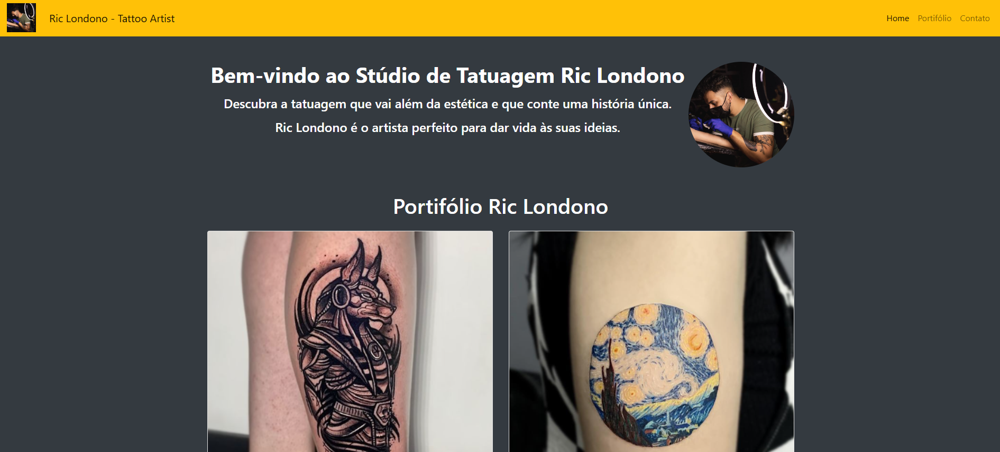

### Ric Londo Artist Tatoo

Esse site foi criado em homenagem ao meu amigo Paulo Ricardo, Tatuador profissional à 8 anos.
Utilzado o código HTML cria um site para o Estúdio de Tatuagem do artista "Ric Londono".
A estrutura básica inclui um cabeçalho de navegação, uma seção de boas-vindas, uma galeria de tatuagens e um rodapé com informações de direitos autorais.
Inclui o Bootstrap para um design responsivo e estilizado.
Contém uma barra de navegação com links para "Home", "Portfólio" e "Contato".
Exibe uma imagem de destaque com um texto de boas-vindas para os visitantes.
Cada item de portfólio (como "Anubis", "Van Gogh", e personagens da Disney e Marvel) é exibido em um cartão com imagem.
Inclui botões "Entre em contato" que levam para uma página de contato, permitindo a possibilidade de enviar uma mensagem pelo WhatsApp. Tem também uma imagem do logo do Instagram e cliando nele é direcionado para o perfil de Ric Londono.